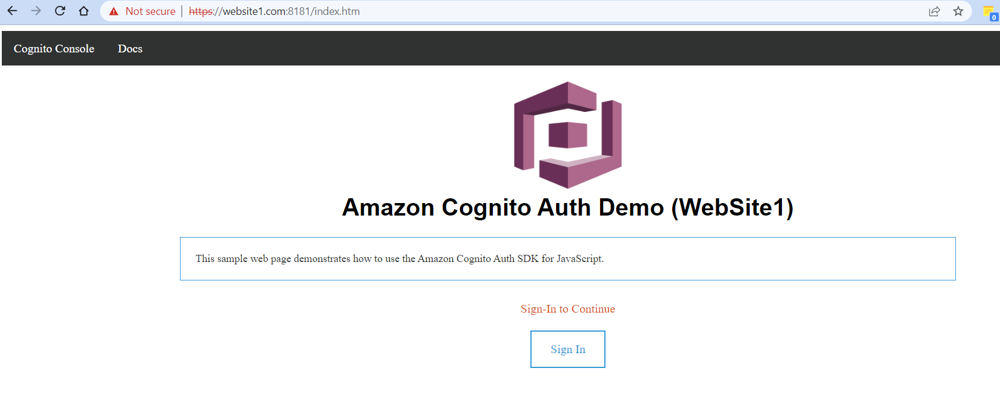

# SSO demo
## _How to create local SSL cert_

- On Windows 10, use ```c:\...\git\mingw64\bin\openssl.exe``` to create cert files in respective folder


- Following command creates certificate files in current folder

`> openssl req -newkey rsa:2048 -new -nodes -x509 -days 3650 -keyout key.pem -out cert.pem`

- Use above command in both `website1` and `website2` folders to have two certificates created.

- While not essential, we can make use of following chrome setting set to true
`chrome://flags/#allow-insecure-localhost`

## _Start multiple websites (from different domains)_

- Add following lines to "hosts" file:

```
127.0.0.1 website1.com
127.0.0.1 website2.com
```
- if not already installed, use following command to install `http-server` globally

`> npm install -g http-server `

- go to "website1" folder and run following command to start web server:

`c..\website1> http-server --port 8181 -S -C cert.pem `

- Open web browser and point to `https://website1.com:8181/index.htm`.  If you experience something as below, please ghost type `thisisunsafe` in chrome browser (as if you are typing in air):

 

- Once certificate issue is resolved, we should be able see the following:
 
 

- go to "website2" folder and run following command to start web server:

`c..\website2> http-server --port 8282 -S -C cert.pem `

- Open web browser and point to `https://website2.com:8282/index.htm`.  

 

## _Testing SSO_

- click "Sign In" on website1 page.  It should redirect to SSO for login as shown below:

 

- Once logged in, it should return back to "website1" page with following message


- Now, let's switch to "website2" page and click on "Sign In".  At this point, it would not ask for credentials anymore but automatically loads the current user context from `website1`.


## _AWS Cognito configuration at a glance_


