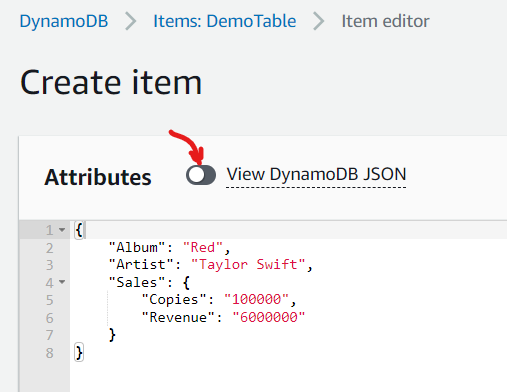
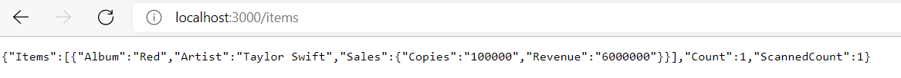
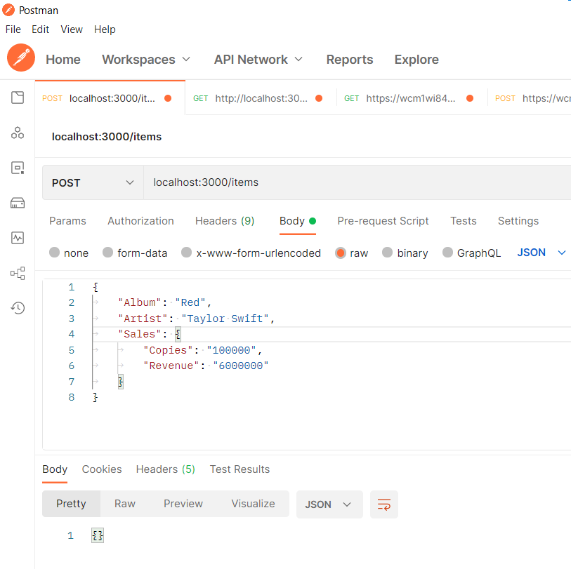
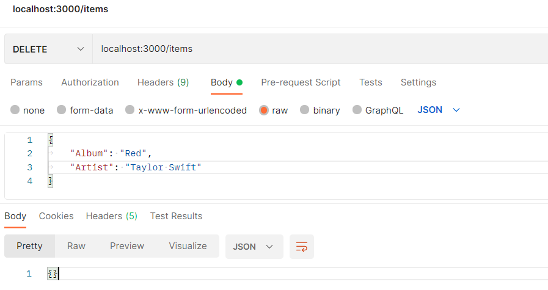
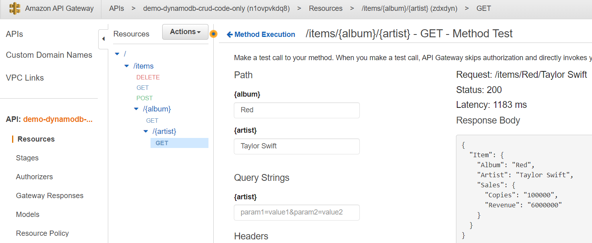
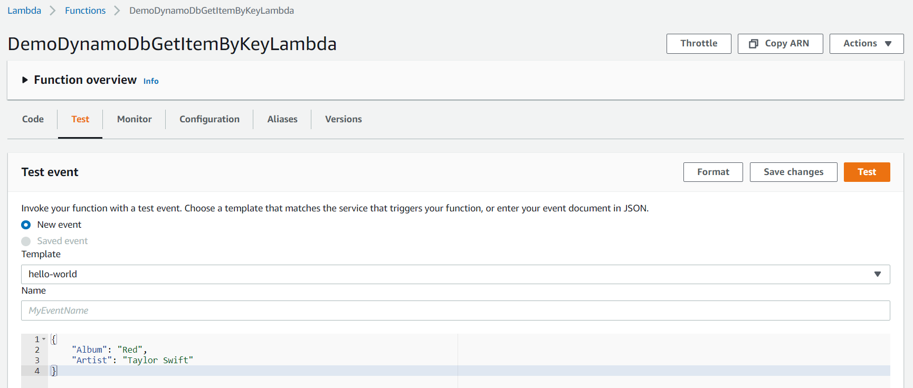
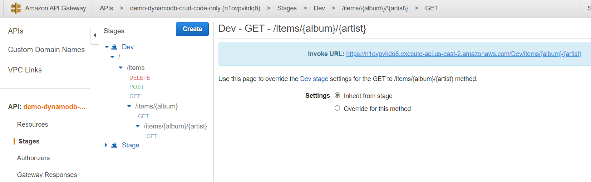
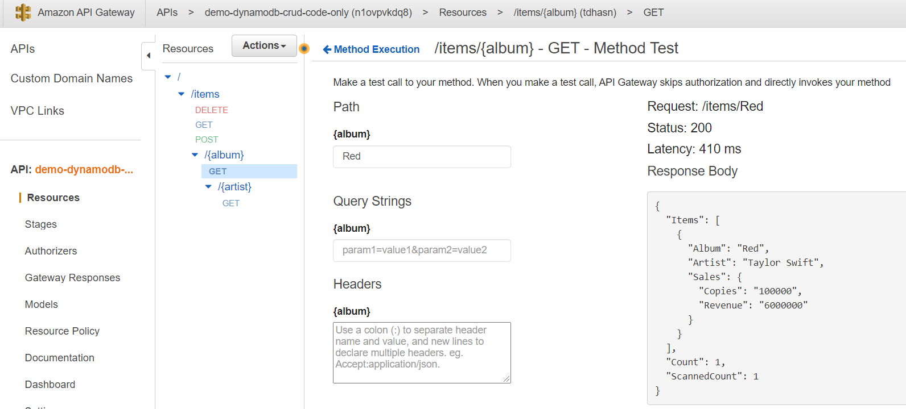
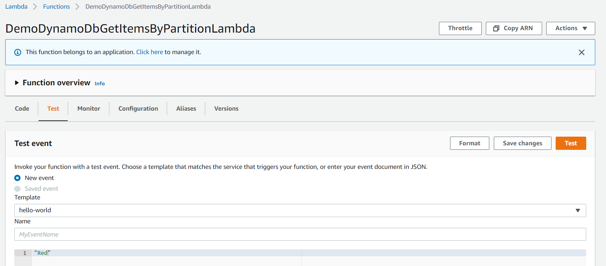

## Demo

An example on how to do CRUD using AWS DynamoDb, Lambda and API Gateway. The sampels demonstrate the following:

- using AWS SAM CLI
- using AWS SDK in node.js (install using "npm install")
- handcrafted multiple template (yaml) files for different types of deployments

NOTE: this uses concepts from previous examples

### Heads-up

- Env: Win 10
- Needs AWS CLI and AWS SAM CLI installed / configured
- Needs Docker Desktop installed
- Needs Node.js/NPM installed
- AWS CLI version: 2.4.9
- SAM CLI version: 1.37.0
- Node version: 14.18.1
- NPM version: 6.14.15

### Steps to deploy / test

#### How to Build

- use following command to build all parts of application (include DynamoDb specifications)

`> sam build --template-file template-code-all.yaml`

- use following command to build only code part (Lambda, API Gateway)

`> sam build --template-file template-code-only.yaml`

#### How to deploy Db for testing

- This uses CloudFormation, S3 and other services behind the scenes
- create an S3 bucket (ex: jag-lambda-apps)
- we need to deploy DynamoDb tables to AWS DynamoDb first. We can achieve that using following command (for multi-line use PowerShell)

```
sam deploy `
--template-file template-db-only.yaml `
 --stack-name demo-dynamodb-crud-db-only `
 --s3-bucket jag-lambda-apps `
 --region us-east-2 `
 --capabilities CAPABILITY_IAM

```

- once deployed, you can add sample data by going to AWS Console | DynamoDb | tables | select <table> | View Items | Create Item



- use following command to test lambda locally

#### How to test read operation (get-all-items) locally

- in order to test "get-all-items" function locally, we can use the following command:

  `> sam local invoke DemoDynamoDbGetAllLambda --template-file template-code-only.yaml`

  or

```
sam local invoke DemoDynamoDbGetAllLambda `
--template-file template-code-only.yaml `
--log-file log.txt
```

- in order to test "get-all-items" http api locally (using browser)

```
sam local start-api `
--template-file template-code-only.yaml `
--port 3000
```

- the above kicks off a web server at port 3000 and we can test the functionality by pointing our browser to

`http://localhost:3000/items`



#### Debugging using VSCode (applies to all operations)

We can still debug/troubleshoot using VSCode (as explained in previous examples)

- for lambda

```
sam local invoke DemoDynamoDbGetAllLambda `
--template-file template-code-only.yaml `
-d 9999
```

- for http api

```
sam local start-api `
--template-file template-code-only.yaml `
--port 3000
--debug-port 9999
```

#### How to test read operation (get-item-by-key) locally

- in order to test "get-item-by-key" function locally, we can use the following command:

```
sam local invoke DemoDynamoDbGetItemByKeyLambda `
 --template-file template-code-only.yaml `
 --event ../sample-data/get-by-key-input.json `
 --log-file log.txt
```

- in order to test "get-item-by-key" http api locally (using browser)

```
sam local start-api `
--template-file template-code-only.yaml `
--port 3000
```

- the above kicks off a web server at port 3000 and we can test the functionality by pointing our browser to

`http://localhost:3000/items/Red/Taylor%20Swift`

#### How to test read operation (get-items-by-partition) locally

- in order to test "get-items-by-partition" function locally, we can use the following command:

```
sam local invoke DemoDynamoDbGetItemsByPartitionLambda `
 --template-file template-code-only.yaml `
 --event ../sample-data/get-by-partition-input.json `
 --log-file log.txt
```

- in order to test "get-items-by-partition" http api locally (using browser)

```
sam local start-api `
--template-file template-code-only.yaml `
--port 3000
```

- the above kicks off a web server at port 3000 and we can test the functionality by pointing our browser to

`http://localhost:3000/items/Red`

#### How to test POST operation (add-item) locally

- in order to test "add-item" function locally, we can use the following command:

```
sam local invoke DemoDynamoDbAddItemLambda `
 --template-file template-code-only.yaml `
 --event ../sample-data/add-item.json `
 --log-file log.txt
```

- in order to test "add-item" http api locally

```
sam local start-api `
--template-file template-code-only.yaml `
--port 3000
```

- the above kicks off a web server at port 3000 and we can test the functionality using postman



#### How to test DELETE operation (delete-item) locally

- in order to test "delete-item" function locally, we can use the following command:

```
sam local invoke DemoDynamoDbDeleteItemLambda `
 --template-file template-code-only.yaml `
 --event ../sample-data/delete-item-input.json `
 --log-file log.txt
```

- in order to test "delete-item" http api locally

```
sam local start-api `
--template-file template-code-only.yaml `
--port 3000
```

- the above kicks off a web server at port 3000 and we can test the functionality using postman



#### How to deploy all code (Lambda + Http API) to AWS cloud

- This uses CloudFormation, S3 and other services behind the scenes
- create an S3 bucket (ex: jag-lambda-apps)
- use following command to deploy only code and without DynamoDb (using powershell)

```
sam deploy `
 --template-file template-code-only.yaml `
 --stack-name demo-dynamodb-crud-code-only `
 --s3-bucket jag-lambda-apps `
 --region us-east-2 `
 --capabilities CAPABILITY_IAM
```

- use following command to deploy everything (all code and db)

```
sam deploy `
 --template-file template-all.yaml `
 --stack-name demo-dynamodb-crud-all `
 --s3-bucket jag-lambda-apps `
 --region us-east-2 `
 --capabilities CAPABILITY_IAM
```

- once deployed, you can check / test using AWS Console

#### How to test read operation (get-item-by-key) in AWS

- using AWS Console with API Gateway
- Go to AWS Console | API Gateway | APIs | demo-dynamodb-crud-code-only | Resources | {album} {artist} {GET} | Test
- Provide "Album" value as "Red" and "Artist" value as "Taylor Swift"
- Hit "Test"



or

- using AWS Console with Lambda
- Go to AWS Console | Lambda | DemoDynamoDbGetItemByKeyLambda | Test
- Provide following as "Test event" parameters and hit "Test"

```
  {
    "Album": "Red",
    "Artist": "Taylor Swift"
  }
```



or

- you can also use external link for testing



#### How to test read operation (get-items-by-partition) in AWS

- using AWS Console with API Gateway
- Go to AWS Console | API Gateway | APIs | demo-dynamodb-crud-code-only | Resources | {album} | {GET} | Test
- Provide "Album" value as "Red"
- Hit "Test"



or

- using AWS Console with Lambda
- Go to AWS Console | Lambda | DemoDynamoDbGetItemsByPartitionLambda | Test
- Provide following as "Test event" parameters and hit "Test"

`"Red"`



#### Delete from AWS

- use following command to delete it from AWS cloud

- if deployed using template-db-only.yaml

`> sam delete --stack-name demo-dynamodb-crud-db-only`

- and similarly for other stacks based on the chosen deployment type earlier
